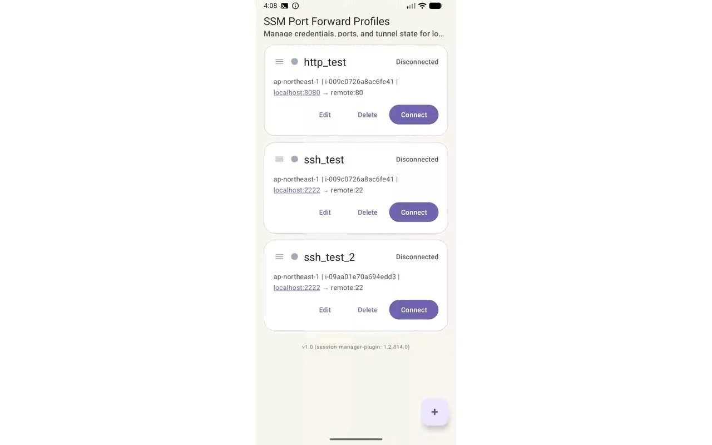
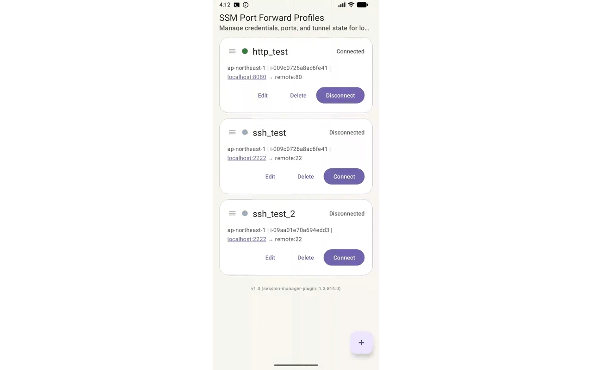

日本語版は[こちら](./README-ja.md)<br><br>

# EC2 Secure Connect

EC2 Secure Connect is an **Android application** that provides secure remote access to EC2 instances using AWS Systems Manager Session Manager. You can **securely** connect to EC2 instances from your Android device without opening ports for SSH or HTTP.<br>
Behind the scenes, the app runs AWS's official [session-manager-plugin](https://github.com/aws/session-manager-plugin).

<br>

<div align="center">

HTTP forwarding demonstration



<br>

SSH forwarding demonstration



</div>

## Requirements

- The EC2 instance must have the SSM Agent running and be accessible from Systems Manager.
- You need an Android device that supports `arm64-v8a` (64-bit architecture).

## Build Instructions

### Local Build

To build `ssm-client` for Android, Go and Android NDK are required. Install the Android NDK through Android Studio before building the project. After installing Go, add the following to `./local.properties`:

Configuration examples:

- For Debug and Release builds without a certificate
```
go.binary=<Path to your Go executable>
```

- For Release builds with a certificate
```
go.binary=<Path to your Go executable>
release.keystore.base64=<Base64 encoded Keystore>
release.keystore.password=<Keystore password>
release.key.alias=<Keystore alias>
release.key.password=<Keystore key password>
```

### GitHub Actions Build

You can automatically build using `build.yml` on GitHub Actions.
Before building, configure the following environment variables in `Repository secrets`:
After the build is complete, you can download the artifacts (APK/AAB) from Artifacts.

```
RELEASE_KEYSTORE_BASE64=<Base64 encoded Keystore>
RELEASE_KEYSTORE_PASSWORD=<Keystore password>
RELEASE_KEY_ALIAS=<Keystore alias>
RELEASE_KEY_PASSWORD=<Keystore key password>
```

## Others

We welcome issues and pull requests!<br>
If you find any bugs or improvement opportunities, please feel free to submit a pull request.

## License

The MIT License (MIT)<br>
Copyright (c) 2026 - Created by Shogo Fukushima
